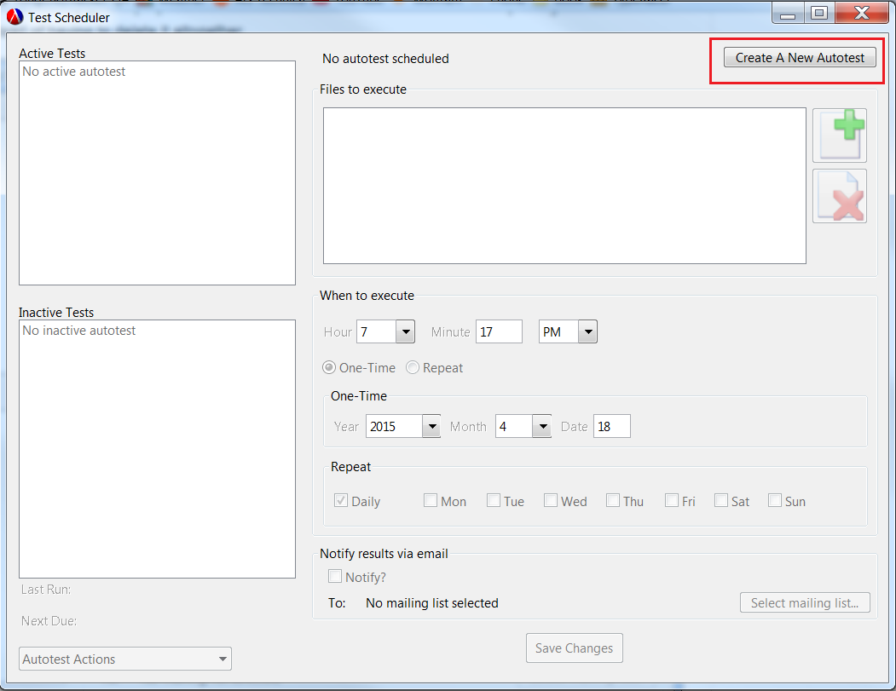
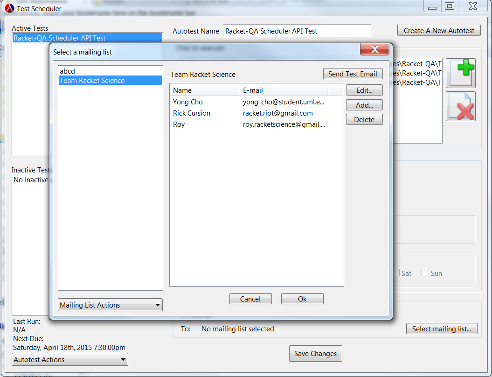

# Racket-QA Automated-Test Scheduler

Racket QA Test Scheduler provides functionality to schedule an execution of RackUnit source files without the user's presence and store its output or send it to a specified mailing list. It is capable of executing RackUnit test suite files generated by <a href="https://github.com/oplS15projects/Racket-QA/blob/master/Bottle-Racket/README.md" target="_blank">**Bottle-Racket**</a> using its APIs, as well as any other Racket source files that can be run with the Racket executable at any given time.

### How to use the Scheduler

In order to start the scheduler, click 'Test Scheduler' icon button from the main UI.

On the left side of the scheduler window are two list boxes containing active and inactive 'autotest' items. An autotest is a kind of a container the scheduler uses to identify a group of racket source files to execute together. You can deactivate an autotest item to temporarily stop a periodic autotest item from executing on its due time. 

When the UI is first launched and there is no autotest configured, you will see empty list boxes.

You can click the "Create A New Autotest" button on the top right corner to schedule a new autotest. Clicking this button will enable the input fields on the right side of the window so you can fill them out. Some of the input fields will be disabled based on whether you have selected 'one-time' or 'repeat' radio button. To schedule a one-time test, you need to provide the time and date to run the test. For repeating test, you need to provide which days of week to run the test.

Here are the list of all the information the scheduler needs from you to scheduler an autotest.
* Name of the autotest item
* Files to execute - one or more files can be associated with an autotest item
* Time of day to execute the test
* Whether to execute it once or periodically
* The date of execution for one-time test
* Days of week to run a periodic test
* Whether to notify the result via email
* Mailing list to be used for e-mail notification

Once you finish filling out the form, you can click either "Schedule and Activate" or "Schedule as Inactivate" button. Clicking "Schedule as Inactive" button will save all information you entered but will not actually cause the test to execute when it comes due. The inactive autotest item will be there for you so you can activate it any time later. You can modify the configuration of the autotest items you have created simply by changing the values you want and clicking "Save Changes" button. The changes will apply immediately.

If you want the test result to be emailed, you can check the "Notify?" check box and configure a mailing list by clicking "Select Mailing List..." button. After the execution of each file, an email will containing the test result will be sent out to the addresses in the mailing list.

If you want to activate, deactivate or delete an autotest item you have created, you can use "Autotest Actions" choice field below the test list boxes. You can also duplicate an autotest item if you want to execute the same files multiple times a day. You can do this by duplicating an autotest item and make it run at different time. It is also ok to make them run at the same time if for any reason you wish to do so. They will run one right after the other in this case.

When an active autotest comes due, the Racket source files associated with it will be executed by <a href="https://github.com/oplS15projects/Racket-QA/blob/master/Bottle-Racket/README.md" target="_blank">**Bottle-Racket**</a> APIs. This will execute the test files the same way you would do it manually with Bottle-Racket, and generate the exact same result. The result file will also be placed where Bottle-Racket would normally place it - same directory as the executed test suite file.

###TODO: have a sample output picture

If the source file is not configured for the Bottle-Racket's test suite file format, the scheduler will fall back to executing it with the Racket executable present on your machine (i.e. racket.exe). This will work same as you would execute the file in the terminal by typing "racket.exe <yourfile.rkt>". The result generated by this way of execution will be every text captured in the file's output and error port (the same output texts you would see in the console). The result file will be saved in "Racket-QA Auto-Test Result" directory created under where the source file was located.

###TODO: have a sample output picture

During the test execution of a file, the scheduler will output to the Dr.Racket REPL console which files are currently being executed.

Once the test execution is complete, a repeating test will wait until the next due day and execute at the same time. One-time test will not execute again, although it will stay in the scheduler UI so you can run it again any time you wish by moving its due time forward.

### Implementation

Here are the files that comprise the test scheduler.
* `autotest.rkt` implements an autotest object that contains all the information necessary to execute a set of racket source files without user intervention, such as the execution time, list of files to execute, whether to notify the results through email, and so on.
* `scheduler.rkt` implements threads to keep track of current time and calls Bottle-Racket APIs to execute autotests as they come due.
* `bg-process.rkt` starts the timer and runner threads defined in `scheduler.rkt`.
* `scheduler-ui.rkt` implements the user interface to schedule an automated test. Information gathered through the UI is saved as an autotest object implemented in the `autotest.rkt`.
* `input-validation.rkt` provides procedures to validate user entries in the scheduler UI.
* `calendar.rkt` provides utility procedures for the autotest object to calculate the correct due time when requested by the scheduler threads.

### Limitation
* The periodic test functionality currently supports automatic execution of a same test as often as daily. It does not support running the same test automatically more than once a day. However, users can easily work around this by creating more than one autotest items with same files and making each autotest run at different hours. The UI provides 'duplicate test' option to make this easy.
* The scheduled tests will run automatically only when bg-process.rkt file stays loaded in the Dr.Racket framework. Once Dr.Racket closes, scheduler threads are terminated and the scheduled tests will not run automatically anymore. The scheduler window can be closed as long as Dr.Racket stays open. Enabling the scheduler threads to stay active without the presence of Dr.Racket requires the scheduler component to be a standalone executable, and may be implemented some time in the future.

<!-- Links -->
[Bottle-Racket Document]: https://github.com/oplS15projects/Racket-QA/blob/master/Bottle-Racket/README.md
