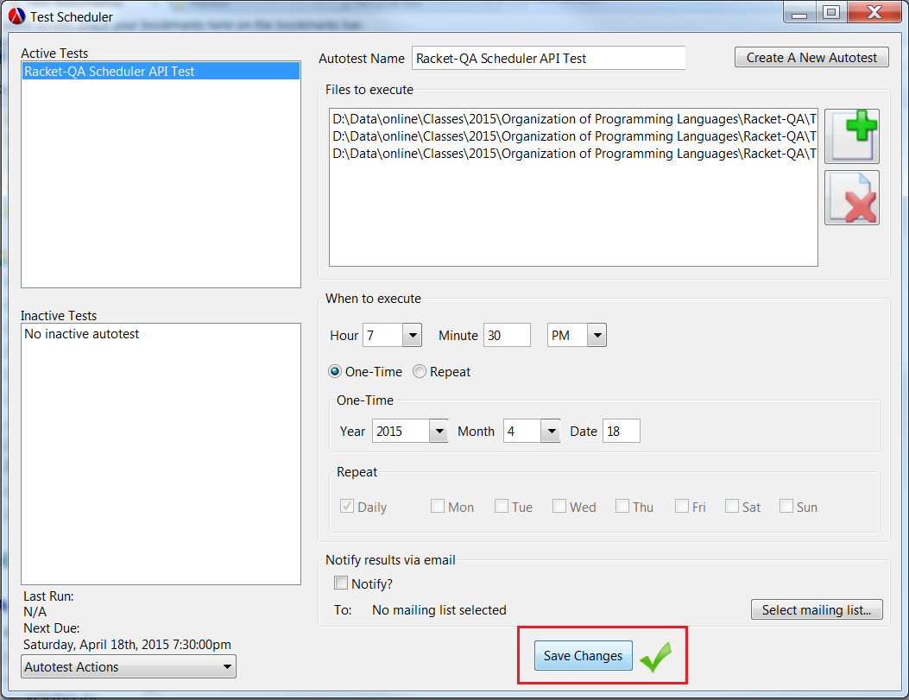
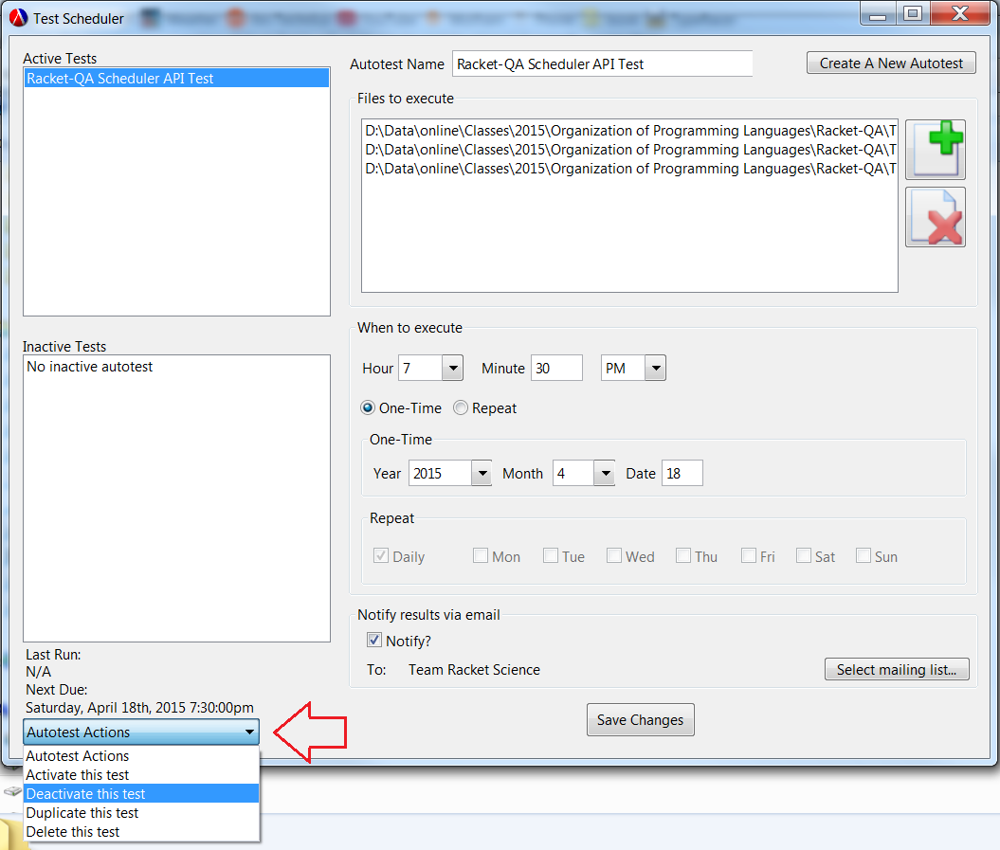

# Racket-QA Automated-Test Scheduler

Racket QA Test Scheduler provides functionality to schedule an execution of RackUnit source files without the user's presence and store its output or send it to a specified mailing list. It is capable of executing RackUnit test suite files generated by <a href="https://github.com/oplS15projects/Racket-QA/blob/master/Bottle-Racket/README.md" target="_blank">**Bottle-Racket**</a> using its APIs, as well as any other Racket source files that can be run with the Racket executable at any given time.

### How to use the Scheduler

In order to start the scheduler, load (require) `scheduler_ui.rkt` and run `(launch-scheduler)` procedure. On the left side of the scheduler window are two list boxes containing active and inactive 'autotest' items. An autotest is a kind of a container scheduler uses to identify multiple Racket source files that are to be handled together and executed at a same time. The purpose of 'inactive' autotest is to allow users to temporarily disable a periodic autotest from running instead of having to delete it altogether. When the UI is first launched and there is no autotest configured, the list boxes will be empty.

User can click the "Create A New Autotest" button on the top right corner to schedule a new autotest. Clicking this button will enable the input fields on the right side of the window so they can be filled out. Some of the input fields will be disabled based on whether the user has selected 'one-time' or 'repeat' radio button. For one-time test, a date of execution must be provided. For repeating test, at least one day of week must be checked. When the user enters an invalid entry or omits a required field, the background color of that field will change to red to signal it needs correction.

The input form collects all the information necessary to manage an autotest item and execute the test files associated with it without user's presence. Here are the information required from the user to schedule an autotest.
* Name of the autotest item
* Files to execute - one or more files can be associated with an autotest item
* Time of day to execute the test
* Whether to execute it once or periodically
* The date of execution for one-time test
* Days of week to run a periodic test
* Whether to notify the result via email
* Mailing list to be used for e-mail notification

The information filled out by the user can be reviewed after the test has been created by clicking the test name shown on either active or inactive test list box. User can also modify the configuration of an autotest item after creating it by editing the input fields and clicking "Save Changes" button.

Clicking "Select Mailing List..." button launches QA-Email UI which allows configuring and selecting a mailing list to associate it with the autotest item if the user wants the result to be mailed.

"Autotest Actions" choice field below the test list boxes allows user to activate, deactivate, duplicate, or delete an autotest item.

When an active autotest comes due, the Racket source files associated with it will be executed by <a href="https://github.com/oplS15projects/Racket-QA/blob/master/Bottle-Racket/README.md" target="_blank">**Bottle-Racket**</a> APIs. If the source file is not configured for the Bottle-Racket APIs, the scheduler will fall back to executing it with the Racket executable (i.e. racket.exe). During the test execution, the scheduler will output to the Dr.Racket REPL console which files are currently being executed.

Once the test is complete, the result files will be generated and placed in locations specified when the test was created through <a href="https://github.com/oplS15projects/Racket-QA/blob/master/Bottle-Racket/README.md" target="_blank">**Bottle-Racket**</a>. For non-Bottle-Racket source files, the output and error ports will be captured and saved in the same directory as the source file executed. If the user had checked the Notify? option and configured a mailing list in the scheduler UI, the result will be mailed to the mailing list. If the test is a repeating test, it will automatically execute again at the next due time. Although a one-time test will only run once, it will stay in the scheduler UI, so the user can run it again by changing its due time.

### Implementation

Here are the files that comprise the test scheduler.
* `autotest.rkt` implements an autotest object that contains all the information necessary to execute a set of racket source files without user intervention, such as the execution time, list of files to execute, whether to notify the results through email, and so on.
* `scheduler.rkt` implements threads to keep track of current time and calls Bottle-Racket APIs to execute autotests as they come due.
* `bg-process.rkt` initializes threads defined in `scheduler.rkt`.
* `scheduler-ui.rkt` implements the user interface to schedule an automated test. Information gathered through the UI is saved as an autotest object implemented in the `autotest.rkt`.
* `input-validation.rkt` provides procedures to validate user entries in the scheduler UI.
* `calendar.rkt` provides utility procedures for the autotest object to calculate the correct due time when requested by the scheduler threads.

### Limitation
* The periodic test functionality currently supports automatic execution of a same test as often as daily. It does not support running the same test automatically more than once a day. However, users can easily work around this by creating more than one autotest items with same files and making each test run at different hours. The UI provides 'duplicate test' option for this.
* The scheduled tests will run automatically only when scheduler_ui.rkt file stays loaded in the Dr.Racket framework. Once Dr.Racket closes, scheduler threads are terminated and the scheduled tests will not run automatically anymore. The scheduler window can be closed as long as Dr.Racket stays open. Enabling the scheduler threads to stay active without the presence of Dr.Racket requires the scheduler component to be a standalone executable, and may be implemented some time in the future.

<!-- Links -->
[Bottle-Racket Document]: https://github.com/oplS15projects/Racket-QA/blob/master/Bottle-Racket/README.md